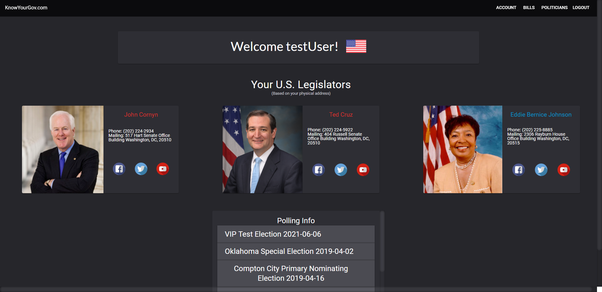
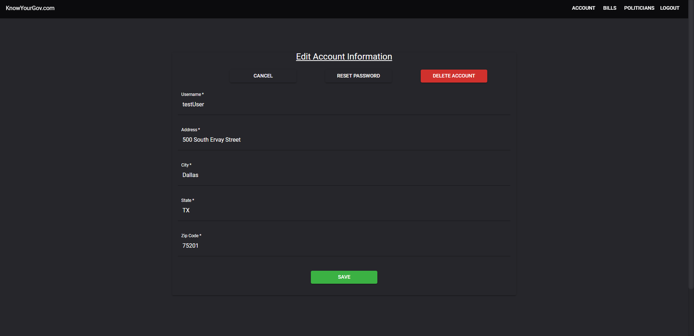
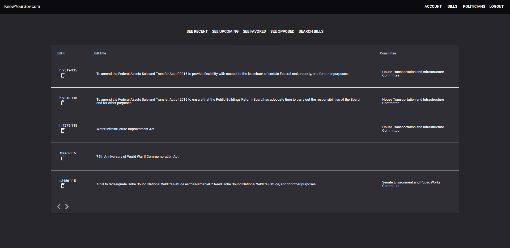
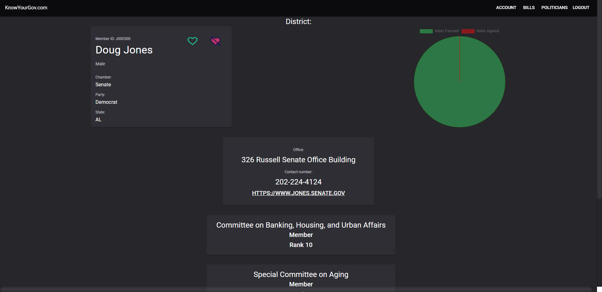

This project was bootstrapped with [Create React App](https://github.com/facebook/create-react-app).

## Know Your Gov - Team Project

### Full Stack App created with React / Redux / Firebase Firestore / Material UI / Google Civic Info API / ProPublica

Team Project focused on tracking bills and politicians in a user-friendly way.
• My Roles:
o Developed the Database and Auth using Firebase & Firestore
o Connected Firebase Database with Redux via Thunk middleware
o Styled Material UI components using Classes PropTypes
o Wrote unit tests for Firebase / end point tests for external APIs

### `Dashboard View`

Dashboard view that displays the users State Legislator (based on address) and upcoming elections

### `Account View`

User Account Page, Users are able to update their account information to display data relevant to them.

### `Bill List view`

Bill List page that conditionally renders recent, upcoming, favored, opposed bills. Also, a search option.

### `Politician View`

Politician view, it gives the user a deeper insight on specific members of congress.
